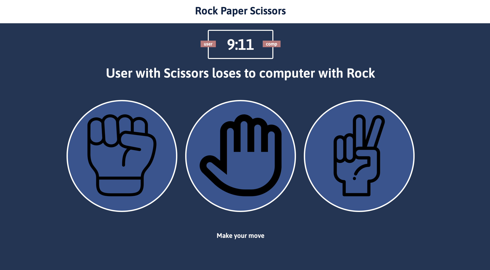

I would like to get familiar with web-development so that I can make some of my other repositories more accssible and friendly. 
This repo is the start to that. 

It's a simple rock-paper-scissors game, made by following the tuturial: 

https://www.youtube.com/watch?v=jaVNP3nIAv0 

